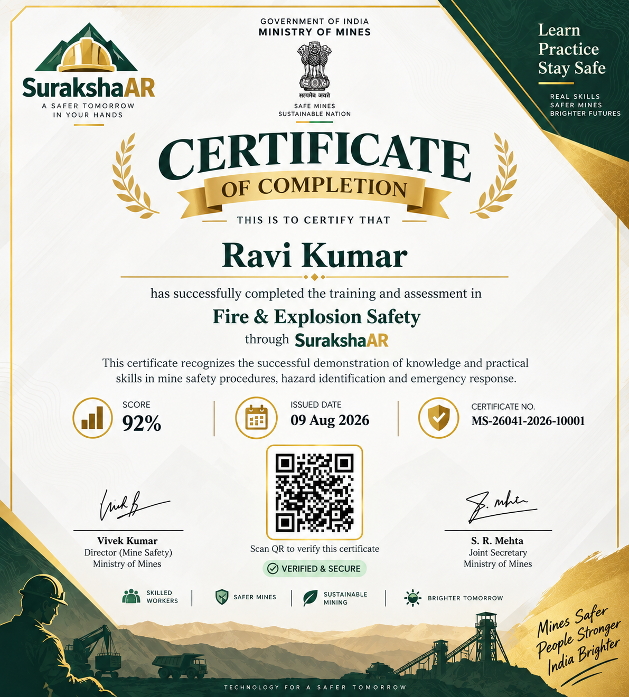

# SurakshaAR

**SurakshaAR** is an interactive industrial safety training platform for mining and manufacturing workers. It teaches fire safety, gas-leak response, confined-space assessment, rescue procedures, and emergency decision-making through guided AR-style simulations.

## Problem

Safety training is often theoretical and difficult to practice safely. SurakshaAR turns common mine-safety scenarios into repeatable interactive exercises that workers can complete on a phone or browser.

## Current Status

The current web application is a **simulated AR training prototype**. It uses interactive spatial scenes, hazard overlays, draggable pointers, readings, models, and guided paths. Live camera input was intentionally disabled for the current demo flow so the training scenario is consistent on every device.

The architecture is ready to connect these interactions to live camera or Unity/WebXR tracking in a later version.

## Main Features

- Worker login using worker ID, name, and workplace
- Worker-specific progress persistence in browser storage
- English, Hindi, and Santali language selection
- Interactive fire-safety scenario
- Interactive gas-leak and confined-space scenario
- Step-by-step back navigation
- Real quiz scoring with correct and incorrect feedback
- Per-competency assessment breakdown
- Pass/fail result based on actual answers
- Dynamic certificate using the SurakshaAR certificate artwork
- Dynamic certificate name, score, date, certificate number, and QR code
- Public certificate verification route
- Responsive mobile-first interface
- Vercel deployment support
- Firebase-ready authentication, Firestore, and storage services

## AR-Style Training Flows

### Fire Safety

1. **Locate the fire hazard**
   - The worker drags a crosshair around the simulated scene.
   - The red/orange fire intensity determines the reading.
   - The reading becomes HIGH when the crosshair reaches the fire.

2. **Identify the extinguisher**
   - The system displays a fire class and extinguisher options.
   - The worker taps the correct extinguisher.
   - Wrong selections are marked red and the correct selection is marked green.

3. **Extinguish the fire**
   - The worker taps the PUMP control.
   - The flame shrinks as the extinguishing progress increases.
   - The scene ends with an EXTINGUISHED state.

### Gas Leak and Confined Space

1. **Detect the gas leak**
   - The worker drags a crosshair around a pipeline scene.
   - Gas concentration is calculated from the distance to the leak source.
   - The PPM reading changes between LOW, MEDIUM, and HIGH.

2. **Assess the confined space**
   - The worker verifies ventilation, oxygen, toxic gas levels, and breathing apparatus.
   - Every safety check must be selected before continuing.

3. **Execute the rescue procedure**
   - The worker drags the rescuer to the downed worker.
   - The victim is secured using breathing apparatus.
   - The rescuer then guides the worker to the EXIT safe zone.

## Assessment and Scoring

The assessment contains five questions. The score is calculated from the answers selected by the worker:

- 1 correct answer = 20%
- 3/5 or more = pass
- Each question is assigned to a competency
- The result screen shows the real overall score
- The competency breakdown shows the real percentage for each category
- Failed attempts do not issue a certificate

## Certificate System

The certificate uses the supplied SurakshaAR artwork as its visual template:



After a successful assessment, the following values are generated from the worker session:

- Login name
- Assessment score
- Issue date
- Worker-specific certificate number
- Certificate ID used by the QR code
- Completed module title

The **View Certificate Online** page uses the same certificate design and dynamic values. The certificate can be printed or saved as a PDF from the browser.

## Data Persistence

When Firebase is not configured, worker data is stored locally per worker ID:

- Worker profile
- Module progress
- Overall safety score
- Certificates earned
- Last quiz score
- Competency breakdown
- Latest certificate metadata

The local storage fallback keeps the demo usable offline. Firebase services are already structured for production authentication, profiles, certificates, and Firestore persistence once real Firebase credentials are provided.

## Technology Stack

- React 18
- TypeScript
- Vite 5
- Tailwind CSS
- React Router
- React Context and Hooks
- `qrcode.react` for certificate QR codes
- Firebase Authentication, Firestore, Storage, and Functions readiness
- Vercel deployment

## Project Structure

```text
SurakshaAR-Web/
├── public/
│   └── assets/
│       └── surakshaar-certificate-template.png
├── src/
│   ├── components/
│   │   ├── layout/                 # Admin layout and protected routes
│   │   └── ui/                     # Header, navigation, icons, shared UI
│   ├── context/
│   │   ├── AppContext.tsx          # Worker state, progress, certificates
│   │   └── AuthContext.tsx         # Firebase/admin authentication
│   ├── hooks/
│   │   └── useColorDetection.ts    # Color-based detection utility
│   ├── pages/
│   │   ├── app/                    # Worker training application
│   │   ├── Admin/                  # Admin dashboard
│   │   ├── Auth/                   # Admin login
│   │   └── Verification/           # Public certificate verification
│   ├── services/
│   │   ├── api/                    # User and session APIs
│   │   ├── certificate/            # Certificate verification
│   │   ├── firebase/               # Firebase initialization
│   │   └── demoData.ts             # Offline demo records
│   ├── styles/index.css            # Tailwind layers and motion styles
│   └── App.tsx                     # Routes and worker screen flow
├── index.html
├── package.json
├── tailwind.config.js
└── vercel.json
```

## Local Development

### Requirements

- Node.js 18 or newer
- npm

### Install

```bash
npm install
```

### Start development server

```bash
npm run dev
```

### Typecheck

```bash
npx tsc --noEmit
```

### Production build

```bash
npm run build
```

## Firebase Setup

Firebase is optional for the offline demo. To enable live Firebase services, replace the placeholder values in:

```text
src/services/firebase/config.ts
```

Required values include:

- API key
- Auth domain
- Project ID
- Storage bucket
- Messaging sender ID
- App ID

Firestore rules and Firebase Functions should be configured before using real worker data in production.

## Deployment

The project is connected to the `Divyansh75-5/SurakshaAR` GitHub repository and is deployable through Vercel.

Every push to the production branch can trigger a new deployment. The Vercel project should use:

- Framework: Vite
- Build command: `npm run build`
- Output directory: `dist`

## Presentation Explanation

SurakshaAR can be presented as an **AR-ready interactive safety simulator**:

> The platform places hazards, readings, tools, rescue targets, and safe zones inside an interactive spatial scene. Workers must locate hazards, interpret live-style readings, select the correct safety equipment, and complete the correct response sequence. The current prototype uses simulated AR overlays for reliable browser demonstrations, while the same interaction layer can later be connected to live camera, WebXR, or Unity AR tracking.

## Future Enhancements

- Live camera-based hazard detection
- WebXR plane and image tracking
- Unity AR Foundation mobile build
- 3D fire extinguisher and breathing apparatus models
- Cloud-synced worker sessions
- Server-side certificate PDF generation
- Admin-configurable training modules and questions
- Audio guidance and multilingual voice instructions
- Sensor or IoT integration for real gas and environmental readings

## License

This project is developed as a safety-training prototype for the SurakshaAR initiative. Add the final project license before public distribution.
